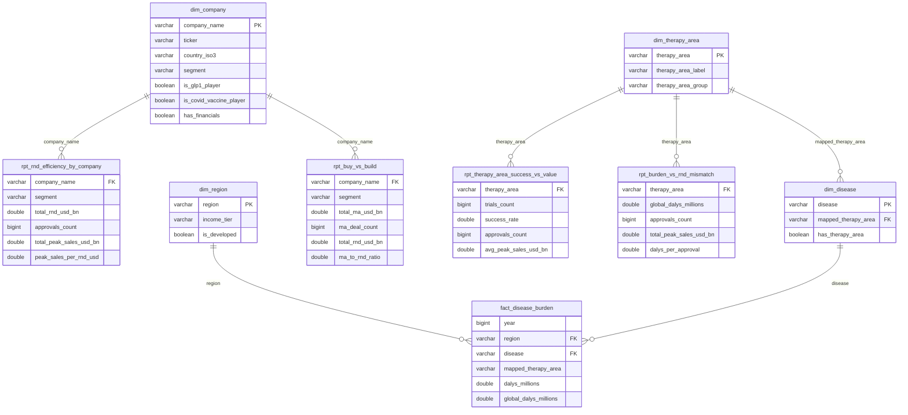

# Pharma Data Engineering on AWS

An end-to-end AWS data engineering project over 17 years of global healthcare and
pharma data (2010–2026). Raw CSVs land in **Amazon S3**, are cataloged with
**AWS Glue** and modeled with **SQL in Amazon Athena**, with a **Glue PySpark**
job handling incremental loads into **Apache Iceberg** — all provisioned as code
with **Terraform**, and surfaced in a **Power BI** dashboard of findings.

> 🚧 **Work in progress.** Storage, catalog, the full SQL modeling layer, and an
> incremental-ingestion pipeline (Glue PySpark → Apache Iceberg) are live; the
> dashboard is next. See progress below.

## Architecture

```text
 data/*.csv ──▶ S3  raw/  ──▶ Glue Crawler ──▶ Glue Data Catalog
                                                     │
                                                     ▼
                                            Amazon Athena (SQL)
                                    crosswalks · dims · facts · analytics
                                                     │ CTAS
                                                     ▼
                                            S3 processed/ (Parquet)
                                                     │
                                                     ▼
                                            Power BI dashboard

 Incremental loads:
   new CSV ──▶ S3 landing/ ──▶ Glue PySpark job ──▶ Iceberg table (append + dedup)
                                        └──▶ move file to S3 archive/

   (all infrastructure defined in Terraform)
```

## Progress

| # | Milestone | Status |
|---|---|---|
| M0 | Toolchain (AWS CLI + Terraform) & a Terraform-managed cost budget | ✅ Done |
| M1 | S3 data lake (raw/processed zones, public-access blocked, versioning) | ✅ Done |
| M2 | Glue database + crawler & Athena workgroup; raw data queryable via SQL | ✅ Done |
| M3 | SQL layer — company & therapy-area crosswalks, dim/fact/analytics tables | ✅ Done |
| M4 | Incremental ingestion — Glue PySpark: landing → Apache Iceberg append → archive | ✅ Done |
| M5 | Power BI dashboard (4 analytics themes) | ⏳ Next |

**Verified so far:**

- Crawler registers all 5 source tables; Athena counts match the source files
  exactly (489 / 722 / 599 / 3310 / 1208).
- Star schema built via Athena SQL: 4 dimensions + 5 facts. Grain checks pass —
  `fact_drug_approvals` is 732 rows for 722 approvals (intentional co-developer
  fan-out from the company crosswalk); other facts stay 1:1.
- Incremental ingestion proven end-to-end: dropping a new CSV in `landing/`
  appended 3 rows to the Iceberg approvals table (722 → 725), archived the file,
  and re-running the same file did **not** double-count (dedup on `approval_id`).

## Data

Five source files (~6,300 rows) covering pharma company financials, FDA drug
approvals, clinical trials, disease burden (DALYs), and biotech funding/M&A.
Source: [Global Healthcare & Pharma 2010–2026](https://www.kaggle.com/datasets/sergionefedov/global-healthcare-and-pharma-2010-2026) (CC0).

The files don't join cleanly — company names differ across files
(`Bristol-Myers Squibb` vs `BMS`, partnered sponsors like `Pfizer/BioNTech`) and
disease burden keys on disease while trials/approvals key on therapy area. The
**SQL centerpiece** resolves these with two crosswalk tables (company-name
normalization + a therapy-area↔disease map), then joins across all five files
into a star schema and per-theme analytics tables.

## Data model (ERD)

The Power BI import model over `pharma_de_processed` — 4 dimensions and
`fact_disease_burden` feed 4 per-theme analytics (`rpt_*`) tables. Relationships
are single-direction 1 (dim) → * (fact/rpt), joined on text keys.



## Stack

`Amazon S3` · `AWS Glue (crawler + PySpark)` · `Amazon Athena` · `Apache Iceberg` · `Terraform` · `Power BI`

## Repository layout

```text
data/          raw source CSVs
infra/         Terraform (S3, Glue, Athena, IAM, budget) — the whole stack as code
sql/           Athena SQL — crosswalks, dims, facts, analytics, checks, iceberg (numbered by run order)
glue/          PySpark ETL script for the incremental-ingestion Glue job
README.md
```

## Running the infrastructure

Requires the AWS CLI (configured credentials) and Terraform.

```bash
cd infra
cp example.tfvars terraform.tfvars   # set your alert email
terraform init
terraform plan                        # preview changes
terraform apply                       # provision S3 + Glue + Athena + budget
```

Load data and catalog it:

```bash
# upload each dataset under its own raw/ prefix (table = prefix, not a file)
aws s3 cp data/drug_approvals.csv s3://<bucket>/raw/drug_approvals/drug_approvals.csv
# … repeat per file …
aws glue start-crawler --name pharma-de-raw-crawler
```

Then query in Athena (workgroup `pharma-de-wg`, database `pharma_de_raw`), e.g.
`SELECT count(*) FROM drug_approvals;`

Tear everything down when idle to stay at ~$0:

```bash
cd infra && terraform destroy
```
