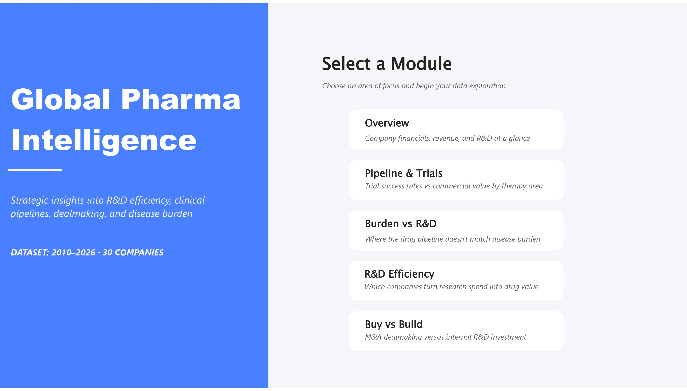
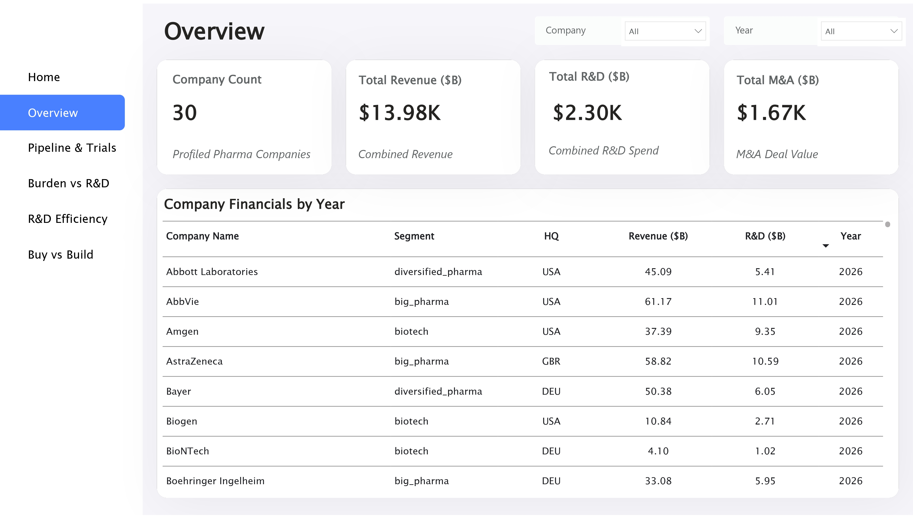
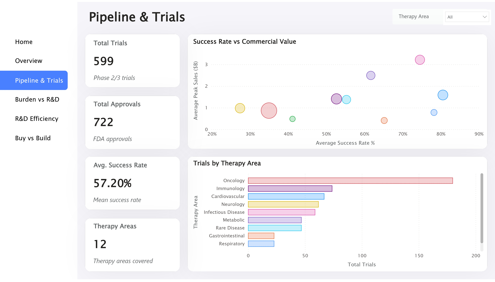
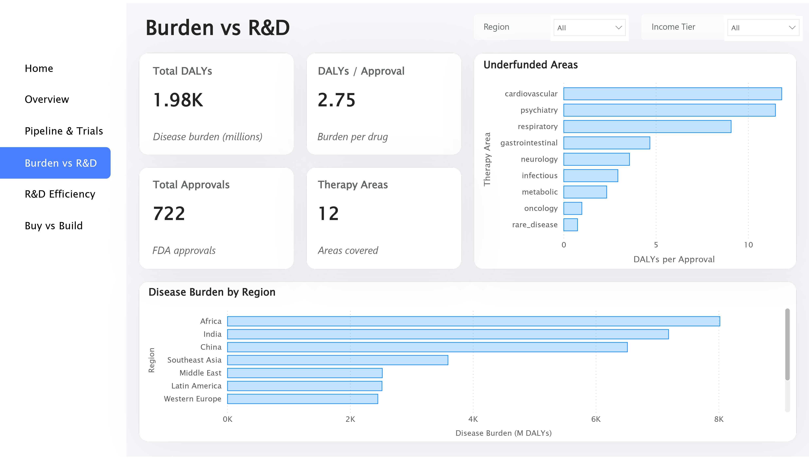
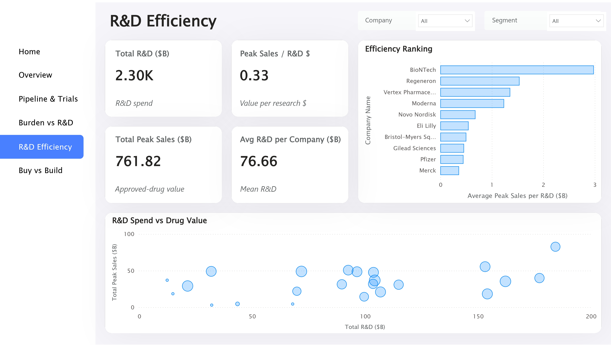
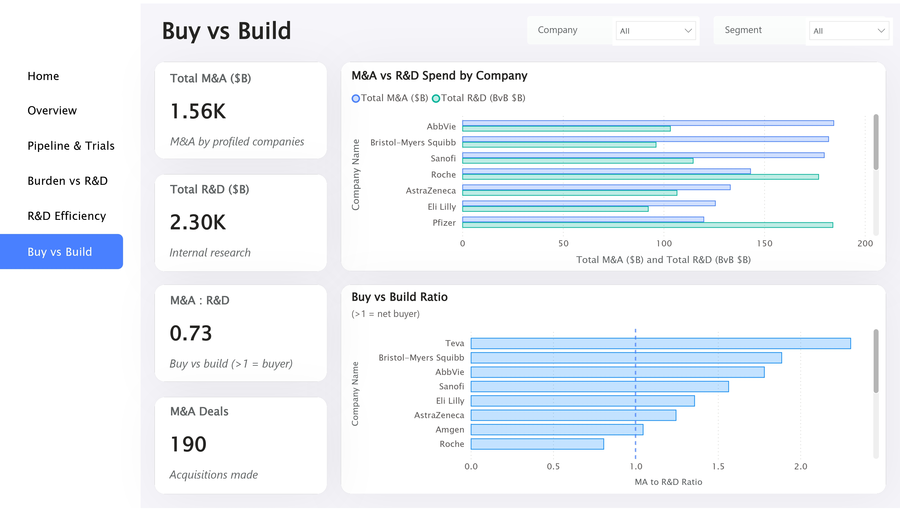

# Global Pharma Intelligence: AWS Data Engineering Pipeline

**An end-to-end cloud data pipeline that turns five messy public datasets into a
6-page business-intelligence dashboard**, built entirely on AWS and provisioned as
code. It takes 17 years of global healthcare & pharma data (2010-2026), engineers it
into an analytics-ready model with SQL, and surfaces real findings on R&D efficiency,
clinical pipelines, dealmaking, and unmet disease burden.

> **Skills Shown:** SQL data modelling · AWS (S3, Glue, Athena) · PySpark · Apache
> Iceberg · Infrastructure as Code (Terraform) · Power BI · data visualisation.

`Amazon S3` · `AWS Glue` · `Amazon Athena` · `Apache Iceberg` · `Terraform` · `Power BI`

---

## The Dashboard

A 6-page Power BI report connected to Amazon Athena, built on a clean star-schema
model. It opens on a landing page that navigates into a company overview plus four
analytical themes.

**Landing Page**



**Overview: Companies, Revenue & R&D**



### The four analytical themes, and what they found

**Pipeline & Trials**: *which therapy areas convert trials into commercial value.*
Oncology runs the most clinical trials but at the **lowest** success rate; the
industry's sweet spot is the high-success, high-value areas.



**Burden vs R&D**: *where the drug pipeline doesn't match disease burden.*
Cardiovascular and psychiatric disease carry roughly **11× the disease burden per
approved drug** of oncology: heavy human cost, comparatively few drugs (under-served).



**R&D Efficiency**: *which companies turn research spend into approved-drug value.*
Small biotechs (BioNTech, Regeneron, Vertex) lead on **peak sales per R&D dollar**.



**Buy vs Build**: *growth by acquisition vs internal research.*
Companies above the 1.0 line (Teva, BMS, AbbVie) grew more by **acquiring** than by
building in-house.



> Full report: the [`.pbix`](powerbi/pharma-analytics-dashboard.pbix) is in
> [`powerbi/`](powerbi/) and a [PDF export](docs/pharma-analytics-dashboard.pdf)
> is in [`docs/`](docs/). It connects to Athena via ODBC in import mode.

---

## How it works

Raw CSVs land in **Amazon S3**, are cataloged by **AWS Glue**, modelled with **SQL in
Amazon Athena**, and served to **Power BI**. A separate **Glue PySpark** job keeps the
warehouse current by loading new files into an **Apache Iceberg** table. Every AWS
resource is defined in **Terraform**.

```text
 data/*.csv ──▶ S3 raw/ ──▶ Glue Crawler ──▶ Glue Data Catalog
                                                   │
                                                   ▼
                                          Amazon Athena (SQL)
                                  crosswalks · dims · facts · analytics
                                                   │ CTAS → Parquet
                                                   ▼
                                          S3 processed/ ──▶ Power BI dashboard

 Incremental loads:
   new CSV ──▶ S3 landing/ ──▶ Glue PySpark job ──▶ Iceberg table (append + dedup)
                                        └──▶ move file to S3 archive/
```

*(A GitHub-renderable version lives in [`docs/architecture.mermaid`](docs/architecture.mermaid).)*

### The interesting engineering problem

The five source files **don't join cleanly**: company names differ across them
(`Bristol-Myers Squibb` vs `BMS`, partnered sponsors like `Pfizer/BioNTech`), and
disease-burden data is keyed on *disease* while trials and approvals are keyed on
*therapy area*. The heart of the project is a **SQL crosswalk layer** that resolves
these: it normalises every company to one canonical name, **splits co-development
deals so both partners get credit**, and bridges disease to therapy area, then joins
all five files into a Kimball star schema and per-theme analytics tables.

---

## What was built

| # | Stage | Outcome |
|---|---|---|
| 1 | **Infrastructure as code** | Whole AWS stack (S3, Glue, Athena, IAM, cost budget) provisioned with Terraform |
| 2 | **S3 data lake** | Raw + curated zones, public access blocked, versioning on |
| 3 | **Catalog & query** | Glue crawler registers the data; Amazon Athena queries it with SQL |
| 4 | **SQL modelling** | Entity-resolution crosswalks + a star schema (dimensions, facts) + analytics marts |
| 5 | **Incremental ingestion** | Glue PySpark job appends new files into an Apache Iceberg table (dedup on business key), then archives them |
| 6 | **BI dashboard** | 6-page Power BI report over the Athena model (ODBC) |

**Verified end-to-end:**
- Athena row counts match the source files exactly (489 / 722 / 599 / 3,310 / 1,208).
- Grain checks pass: `fact_drug_approvals` is 732 rows for 722 approvals (an
  intentional co-developer fan-out from the company crosswalk); other facts stay 1:1.
- Incremental ingestion proven: dropping a new CSV appended 3 rows (722 → 725),
  archived the file, and re-running the same file did **not** double-count.

---

## Data

Five source files (~6,300 rows) covering pharma company financials, FDA drug
approvals, clinical trials, disease burden (DALYs), and biotech funding / M&A. Source:
[Global Healthcare & Pharma 2010-2026](https://www.kaggle.com/datasets/sergionefedov/global-healthcare-and-pharma-2010-2026)
(CC0). *Curated public data: the pipeline is production-shaped; the findings are
illustrative.*

## Data model

The Power BI import model over `pharma_de_processed`: 4 dimensions + 3 facts + 4
pre-aggregated analytics (`rpt_*`) tables. Every relationship is single-direction,
many-to-one (dimension → fact/analytics), joined on text/integer keys. ERD source:
[`docs/erd.mermaid`](docs/erd.mermaid).

<details>
<summary>Entity-relationship diagram (click to expand)</summary>


```mermaid
erDiagram
    dim_company {
        varchar company_name PK
        varchar ticker
        varchar country_iso3
        varchar segment
        boolean is_glp1_player
        boolean is_covid_vaccine_player
        boolean has_financials
    }
    dim_therapy_area {
        varchar therapy_area PK
        varchar therapy_area_label
        varchar therapy_area_group
    }
    dim_region {
        varchar region PK
        varchar income_tier
        boolean is_developed
    }
    dim_year {
        bigint Year PK
    }

    fact_financials {
        varchar company_name FK
        bigint year FK
        double revenue_usd_bn
        double operating_margin_pct
        double operating_income_usd_bn
        double rd_spend_usd_bn
        bigint pipeline_size_est
    }
    fact_biotech_funding {
        bigint deal_id
        bigint year FK
        varchar acquirer_company FK
        varchar target_name
        varchar deal_type
        double value_usd_bn
        boolean is_megadeal
    }
    fact_disease_burden {
        bigint year FK
        varchar region FK
        varchar disease
        varchar mapped_therapy_area
        double dalys_millions
        double global_dalys_millions
    }

    rpt_rnd_efficiency_by_company {
        varchar company_name FK
        varchar segment
        double total_rnd_usd_bn
        bigint approvals_count
        double total_peak_sales_usd_bn
        double peak_sales_per_rnd_usd
    }
    rpt_buy_vs_build {
        varchar company_name FK
        varchar segment
        double total_ma_usd_bn
        bigint ma_deal_count
        double total_rnd_usd_bn
        double ma_to_rnd_ratio
    }
    rpt_therapy_area_success_vs_value {
        varchar therapy_area FK
        bigint trials_count
        double success_rate
        bigint approvals_count
        double avg_peak_sales_usd_bn
    }
    rpt_burden_vs_rnd_mismatch {
        varchar therapy_area FK
        double global_dalys_millions
        bigint approvals_count
        double total_peak_sales_usd_bn
        double dalys_per_approval
    }

    dim_company      ||--o{ fact_financials                   : "company_name"
    dim_company      ||--o{ fact_biotech_funding              : "acquirer_company"
    dim_company      ||--o{ rpt_rnd_efficiency_by_company     : "company_name"
    dim_company      ||--o{ rpt_buy_vs_build                  : "company_name"
    dim_therapy_area ||--o{ rpt_therapy_area_success_vs_value : "therapy_area"
    dim_therapy_area ||--o{ rpt_burden_vs_rnd_mismatch        : "therapy_area"
    dim_region       ||--o{ fact_disease_burden               : "region"
    dim_year         ||--o{ fact_financials                   : "year"
    dim_year         ||--o{ fact_biotech_funding              : "year"
    dim_year         ||--o{ fact_disease_burden               : "year"
```

</details>

## Repository layout

```text
data/          raw source CSVs (+ overview README)
infra/         Terraform - the whole AWS stack as code (S3, Glue, Athena, IAM, budget)
sql/           Athena SQL - crosswalks, dims, facts, analytics, checks, iceberg (numbered by run order)
glue/          PySpark ETL script for the incremental-ingestion Glue job
powerbi/       the Power BI report (.pbix)
docs/          ERD + architecture diagrams, PDF export, dashboard screenshots
```

## Running it yourself

<details>
<summary>Provision the pipeline (requires AWS CLI + Terraform)</summary>

```bash
cd infra
cp example.tfvars terraform.tfvars   # set your alert email
terraform init
terraform plan                        # preview changes
terraform apply                       # provision S3 + Glue + Athena + budget
```

Load and catalog the data:

```bash
# upload each dataset under its own raw/ prefix (a table = a prefix, not a file)
aws s3 cp data/drug_approvals.csv s3://<bucket>/raw/drug_approvals/drug_approvals.csv
# … repeat per file …
aws glue start-crawler --name pharma-de-raw-crawler
```

Then query in Athena (workgroup `pharma-de-wg`, database `pharma_de_raw`), e.g.
`SELECT count(*) FROM drug_approvals;`. Model the data by running `sql/` in order
(`10 → 51`).

Tear everything down when idle to stay at ~$0:

```bash
cd infra && terraform destroy
```

</details>
